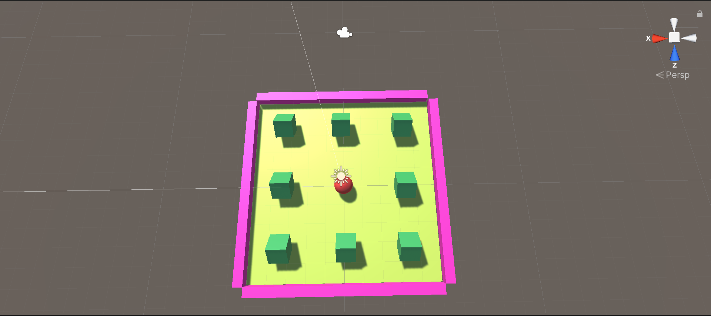
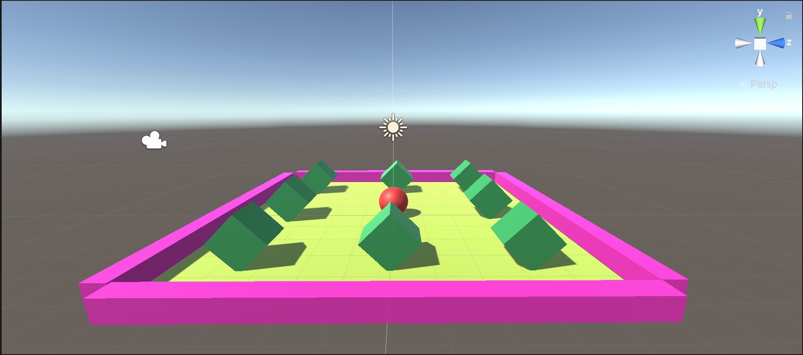

# Roll-A-Ball Game 
This is a basic Unity-3D project in which user controls a ball and if object hits the rotating cubical barrier and scores point for every hit on target.

## Requirements
- Unity 3D software
- VS Code(or any other IDE for coding such as Sublime Text,etc)

### Screenshots of Game 

### Gameplay

